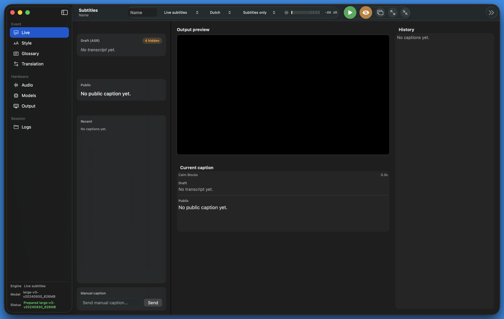

# EventSubtitles

A native macOS app, displayed as `Subtitles`, for offline live subtitles and Dutch/English translation at events.



## Documentation

Start with the documentation index in [docs/README.md](docs/README.md).

- [Architecture](docs/architecture.md)
- [Event runbook](docs/event-runbook.md)
- [Stream Deck integration](docs/stream-deck.md)
- [Lessons learned](docs/lessons-learned.md)
- [Release process](docs/release-process.md)

## Features

Subtitles is built for live event operation: the main window keeps session controls, capture mode, audio level, Start/Stop, panic blank, and output-window actions within reach while the operator works in Live, Style, Glossary, Logs, Models, Translation, Audio, or Output workspaces.

The app runs locally on Apple Silicon with WhisperKit/Core ML for live subtitles, optional Dutch/English translation paths, and a shared audio capture pipeline for metering, CAF recording, and ASR input. Capture modes cover real live subtitles, demo captions for screen checks, and audio-only recording.

Public output is designed for readability rather than raw ASR speed. Calm Blocks and TV-style Live Roll-up modes separate draft text from stable on-screen captions, with line hold, idle flush, two/three-line wrapping, font/color controls, fine X/Y positioning, chroma green output, and emergency blanking.

Event preparation and review are covered in-app: prepare offline models, manage an IT-conference glossary with validation and JSON/CSV import/export, prevent Mac sleep during active sessions, and save timestamped session folders with transcripts, SRT files, JSONL segments, glossary snapshots, and raw input audio.

## Run

```bash
swift run EventSubtitles
```

The app starts in a safe operator UI with a persistent left strip and workspaces on the right. Use the `Capture` picker to choose between demo captions, live local subtitles, or audio-only recording. Use a USB-C audio interface for event audio rather than the MacBook headphone jack. By default, pressing Start keeps the Mac and output display awake until Stop.

For actual event use, build a macOS app bundle so microphone permissions are tied to the app:

```bash
./scripts/build_app_bundle.sh
open build/EventSubtitles.app
```

To prepare a WhisperKit model from Terminal before going offline:

```bash
swift run PrepareWhisperModel large-v3-v20240930_626MB
```

## Download

GitHub releases include a zipped macOS app bundle:

```text
EventSubtitles-v3.3.0-macos-arm64.zip
```

Unzip it and launch `EventSubtitles.app`. The app is ad-hoc signed for local testing, so macOS may require opening it from Finder with Control-click > Open the first time.

Starting a session creates a timestamped folder under:

```text
~/Documents/EventSubtitles/YYYY-MM-DD_HH-mm-ss_<session-name>_<mode>/
```

Each session folder contains:

- `metadata.json`
- `glossary.txt`
- `source-transcript.txt`
- `display-transcript.txt`
- `segments.jsonl`
- `draft.srt`
- `source.srt`
- `display.srt`
- `input-audio.caf`

`source-transcript.txt` is the spoken-word transcript. `display-transcript.txt` is what was shown on screen after glossary correction and optional translation. `source.srt` and `display.srt` are regenerated after every final segment with approximate timings. `draft.srt` mirrors the display SRT for quick review.

## Model Plan

The intended production path is:

```text
USB audio interface
  -> local ASR engine, initially WhisperKit/Core ML
  -> draft buffer and stability gate
  -> glossary correction
  -> optional local EN/NL or NL/EN translation
  -> calm caption scheduler and subtitle composer
  -> full-screen HDMI/chroma-key output
```

The app includes a `Live subtitles` capture option backed by WhisperKit. Use the Models workspace to prepare/download a Core ML model before the event, while online. Once cached locally, the live path can run offline. The Models workspace also shows offline readiness, app memory usage, and a shortcut to Activity Monitor for CPU/GPU checks.

For translation, the app has two local paths:

- `Glossary/rules`: deterministic fallback for demos and terminology protection.
- `Local command`: calls an offline translator executable with text on stdin and reads translated text from stdout. The argument template supports `{source}` and `{target}` tokens such as `--from {source} --to {target}`.

The runtime is optimized around Mac-native WhisperKit on Apple Silicon.
